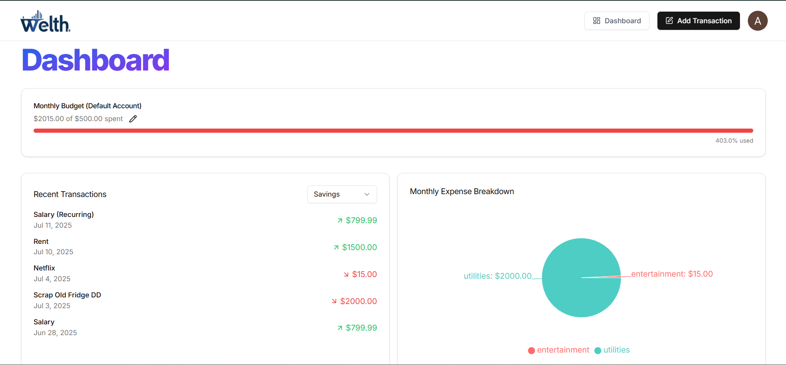
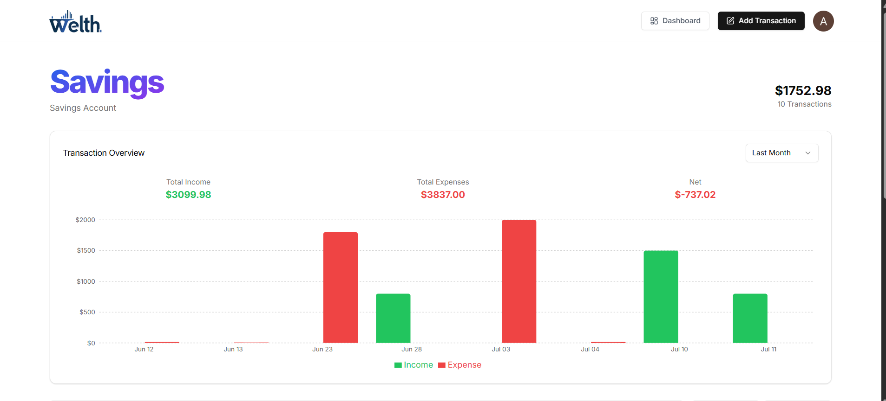
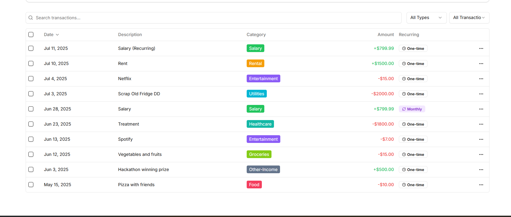
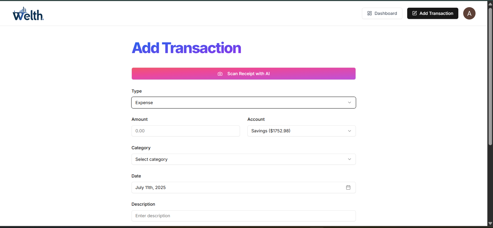
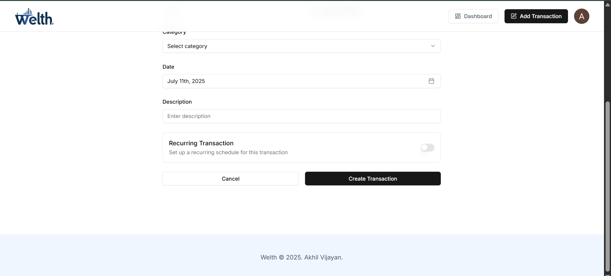
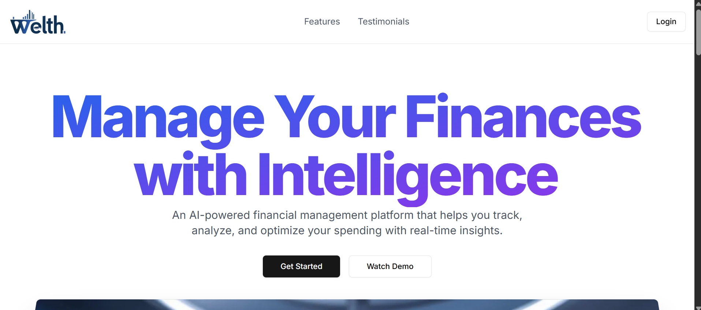

# Welth – AI Finance Platform

**Welth** is a full-stack, AI-powered financial management platform that helps users track, analyze, and optimize their spending with real-time insights. Built with Next.js, Prisma, Clerk, Inngest, ArcJet, Tailwind CSS, and more, Welth offers a modern, secure, and intelligent way to manage personal finances.

---

## 🚀 Features

- **AI-Powered Analytics:** Get detailed insights into your spending patterns with AI-powered analytics.
- **Smart Receipt Scanner:** Extract data automatically from receipts using advanced AI (Google Gemini).
- **Budget Planning:** Create and manage budgets with intelligent recommendations.
- **Automated Insights:** Receive automated financial insights and recommendations.
- **Recurring Transactions:** Track and manage recurring expenses and incomes.
- **Email Reports & Alerts:** Get monthly financial reports and budget alerts via email.
- **Secure Authentication:** User authentication and session management via Clerk.
- **Modern UI:** Built with Tailwind CSS and Shadcn UI for a beautiful, responsive experience.

---

## 🏗️ Tech Stack

- **Frontend:** Next.js (App Router), React, Tailwind CSS, Shadcn UI
- **Backend:** Next.js API routes, Prisma ORM, PostgreSQL
- **Authentication:** Clerk
- **AI/ML:** Google Gemini (Generative AI)
- **Email:** Resend, React Email
- **Background Jobs:** Inngest
- **Security:** ArcJet
- **Other:** Recharts, Lucide Icons

---

## 📂 Project Structure

```
ai-finance-platform/
  ├── actions/           # Server actions for accounts, budgets, transactions, etc.
  ├── app/               # Next.js app directory (pages, layouts, API routes)
  ├── components/        # Reusable UI components
  ├── data/              # Static data (categories, landing page)
  ├── emails/            # Email templates
  ├── hooks/             # Custom React hooks
  ├── lib/               # Utility libraries, Prisma, Inngest, etc.
  ├── prisma/            # Prisma schema and migrations
  ├── public/            # Static assets (images, icons)
  ├── README.md
  └── package.json
```

---

## ⚡ Getting Started

### 1. Clone the repository

```sh
git clone https://github.com/Akii017/Welth-AI-Finance-Tracker.git
cd ai-finance-platform
```

### 2. Install dependencies

```sh
npm install
```

### 3. Set up environment variables

Create a `.env` file in the root directory with the following variables:

```
DATABASE_URL=
DIRECT_URL=

NEXT_PUBLIC_CLERK_PUBLISHABLE_KEY=
CLERK_SECRET_KEY=
NEXT_PUBLIC_CLERK_SIGN_IN_URL=/sign-in
NEXT_PUBLIC_CLERK_SIGN_UP_URL=/sign-up
NEXT_PUBLIC_CLERK_AFTER_SIGN_IN_URL=/onboarding
NEXT_PUBLIC_CLERK_AFTER_SIGN_UP_URL=/onboarding

GEMINI_API_KEY=

RESEND_API_KEY=

ARCJET_KEY=
```

### 4. Set up the database

Run Prisma migrations to set up your database schema:

```sh
npx prisma migrate deploy
```

### 5. Start the development server

```sh
npm run dev
```

Visit [http://localhost:3000](http://localhost:3000) to view the app.

---

## 🧩 Key Modules

- **Dashboard:** Overview of accounts, budgets, and recent transactions.
- **Accounts:** Add, view, and manage multiple financial accounts.
- **Transactions:** Add, edit, and categorize transactions. Scan receipts using AI.
- **Budgets:** Set and track monthly budgets. Get alerts when nearing limits.
- **Reports:** Receive monthly email reports with AI-generated insights.
- **Authentication:** Secure sign-up/sign-in with Clerk.

---

## 🛡️ Security

- Uses ArcJet for bot detection and request shielding.
- Clerk for secure authentication and session management.

---

## 📧 Email & AI

- **Emails:** Transactional and report emails are sent using Resend and React Email.
- **AI:** Google Gemini is used for receipt scanning and generating financial insights.

---

## 📊 Stats (Demo Data)

- 50K+ Active Users
- $2B+ Transactions Tracked
- 99.9% Uptime
- 4.9/5 User Rating

---

## 📸 Screenshots

Here are some screenshots of the platform in action:

| Dashboard                              | Dashboard (Alt)                              |
| -------------------------------------- | -------------------------------------------- |
|  |  |

| Account                            | Account (Alt)                         |
| ---------------------------------- | ------------------------------------- |
|  |  |

| Add Transaction                                   | Add Transaction (Alt)                                |
| ------------------------------------------------- | ---------------------------------------------------- |
|  |  |

| Landing Page                       |
| ---------------------------------- |
|  |

---

## 🎥 Video Walkthrough

Check out the full video walkthrough of the platform:

[Watch on Google Drive](https://drive.google.com/file/d/1nA8kfpkuQXd988Q4bp9nvmARgKyB7tuX/view?usp=sharing)

---

## 🙏 Credits

- Built by Akhil Vijayan
- Inspired by modern finance management needs

---

## 📜 License

This project is for educational/demo purposes. Please check with the author for production/commercial use.

---
